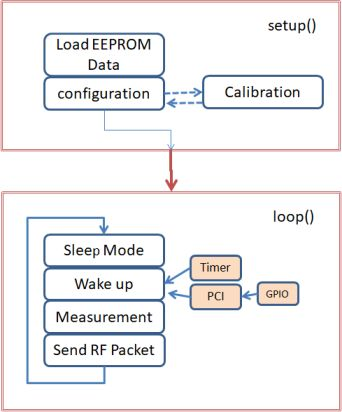

# Projekt Tino
"**TI**ny **No**de" : battery operated wireless sensor or wireless actor.
Object of the project is the development of small size, cost effective battery powered wireless sensors. The sensors communicate with gateways, like a Raspberry Pi. Targets of the development are:

- low cost (BOM below 5 Euro)
- very small size (matchbox)
- very low power consumption
- ultra low sleep current
- long battery life time: 5 years and more on a CR2032 cell
- long range (what ever this means :-), but its really long)
- simplicity
- high grade of communication security
- Plug&Play Firmware
- a certain grade of manufacturability.

Sensors can be almost any, like temperature, relative humidity, air pressure, altitude meter, light intensity, UV Index,
movement detectors, Reed switches, etc. However sensors have to be specified to work down to 2.2V. Otherwise the charge of the battery can not be fully used.

PCBs fit into low cost PVC boxes with the size of a matchbox that are readily available on the market.

## Content
- [Project Description](#project-description)
- [Concept](#concept)
- [How does it work?](#how-does-it-work)
- [IDE setup](#ide-setup)
- [Compile and Flash Software](#compile-and-flash-software)
- [Configuration of Nodes](#configuration-of-nodes)
- [Build a TiNo](#build-a-tino)
- [Electronics](#electronics)
- [Printed Circuit Boards (PCB's)](#printed-circuit-boards-pcbs)
- [Mechanics](#mechanics)

## Project Description
A TiNo sensor takes measurements periodically, for example a temperature reading, and transmits the result over the air to a base station (gateway). The gateway then processes the received data and stores them, which, for example, can be used by cloud services. TiNo can also be used as a monitoring system, for example it can report the opening of doors or windows.

The development started searching for commercially available and affordable enclosures and estimating the required real estate for the PCB's.
The result is a wireless sensor which has been optimized in all important areas in the size of a matchbox. I call it TINO = **TI**ny **NO**de. Later it will become the **TI**ny **N**etw**O**rk. Regarding software there is still a lot of work to do.

## Concept
### Minimal Cost:

At the moment the choice of the  ATMega328 processors together with the RFM69CW RF-module is the lowest possible cost variant for makers. There is no need for a LDO or a DC-DC converter. All modules, including the sensor, are directly operated by a 3V CR2032 cell, two AAA batteries or two AA batteries. More cost savings can be realized if the PCB real estate is minimized. This way more PCB's can be accommodated on a multi-frame PCB in production. 

### Minimal Size
Due to the used frequencies in the ISM Band we cannot downsize the sensor as desired, without big concessions to performance.
With dimensions of approximately 35 x 50 mm I have had good experiences in the 868MHz ISM Band. The 433MHz ISM Band works sufficient as well.
### Minimal current consumption
Consistent implementation of the possibilities of the ATMega328 processor. Optimization of RF parameters. Optimization of powering the system. Use of energy-saving sensors.
### Maximum Battery life time
The life time of a battery depends on its use case. Mainly Four elements contribute to the battery life time:

1. The battery. TiNo sensors use a CR2032 coin cell. This kind of battery has a typical usable capacity of 200mAh.
2. energy consumption of a single transmit pulse. I optimized the duration of the transmit pulse as well as the power consumption during the pulse.
3. Sleep current. The sleep current was optimized as well. using an external 32.678kHz clock crystal the processor works in sleep mode like a RTC (Real Time Clock). This way I measured sleep currents as low as 1.2µA. Without clock crystal the internal RC oscillator is used. This will consume approximately 4µA, which still is a very good value.
4. The number of transmit pulses per time. With a rate of one pulse per minute the current consumption of the pulses dominates. With a rate of one pulse per hour the sleep current outweighs the current consumption of the transmit pulses.

A typical temperature/humidity sensor transmits one pulse every 30 minutes, so a CR2032 cell should have a life time of 5 years or even longer.
In case you understand German, [in my Blog](https://nurazur.wordpress.com/2018/02/25/batterielebensdauer-eines-tx-nodes-verlaengern-mit-einem-32-768-khz-quarz/) I have explained all this extensively.
### Maximum Range
Optimization of the Layouts. Optimization of the RF parameters. this increases RF sensitivity considerably. Optimization of the RF driver to achieve maximum transmit power.
### Maximum Security
The transmitted message is encrypted. The key cannot be read from flash memory if the processor has been locked for reading before. "Rolling codes" are used so that each message is more or less unique and makes eavesdropping pretty difficult.
### Simplicity
In some areas there is still room for improvement, admitted.
#### Plug&Play Firmware
There is a module available in the Boards Manager of the Arduino IDE.
#### Straightforward Hardware
## How does it work?

A TiNo is a sensor which takes periodically measurements and transmits the results using radio frequencies to a gateway. Usually this gateway consists of another TiNo, configured as a receiver node, and a Raspberry Pi. The two communicate over the serial interface. The receiving TiNo receives the RF signal, decodes it, filters out erroneous data and communicates plausible data to the Raspberry Pi. The message is acknowledged if requested. The protocol used between the receiving TiNo and the Raspberry Pi is simple, but it could possibly follow any arbitrary standard, for example RFLink.

By default TiNos can react to external events, for example Reed contacts.
A program running on the Raspberry Pi processes and records the data coming from the receiving TiNo. A web application can use these data and display them graphically. However, this is not (yet) part of the TiNo project.
Two TiNo's are required to establish a wireless connection. One needs to be configured as a "sender", the other one as a "receiver".

### Hardware architecture
TiNo Boards are developed as simple as possible:
- directly powered by a 3V battery.
- ATMega328p-au processor
- RFM69CW or RFM69HCW or RFM95 module from HopeRF
- Footprint for a HTU21D/SHT20/SHT21/SHT25 on PCB
- any I2C Sensor can be connected.
- Battery holder (CR2032 cell)
- ISP (in-System-Programming) Adapter, 2x3 Pin row
- FTDI Adapter, 1x6 Pin row
- configurable GPIO's usable for external digital events
- Status LED
- some Boards have a optional SMA socket for an external antenna
- all PCB's are conceptually developed for defined enclosures, but can be used otherwise (of course!)

### Software architecture

## IDE setup
### prerequisites
- You should have some solder equipment and solder skills to build up the hardware.
- You should know what the Arduino IDE is.
- You need to install the Arduino IDE on your PC.
- You should know what a "sketch" is.
- The following is easier to understand if you know what a "bootloader" is.
- some basic knowledge of C/C++ is an advantage, but not necessarily required.

In case all that don't tell you anything, then it is better to purchase ready flashed and configured product. Write me an e-mail to nurazur@gmail.com and I will send you the current price list.

### Install TiNo library
- launch Arduino IDE.
- open `File->Preferences`.
- at `Additional Boards Manager URL's` enter this link:
`https://raw.githubusercontent.com/nurazur/TiNo/master/package_tino_index.json`
- Navigate to `Tools->Board`: this opens a long list. at the top, click `Boards Manager...`
- search for `Tiny Node AVR Boards` in the boards manager.
- click `Install`.
This installs all libraries required to operate the wireless protocol.

### Install additional required libraries  
Additionally you need the following libraries:
- *SoftwareWire*        (for I2C Bus Sensors) ATTENTION: Use Version **1.4.1**. Later versions are **not** compatible!
- *HTU21D_SoftwareWire* (for the HTU21D sensor)
- *SHT3x_SoftwareWire*  (for the SHT3x sensor)
- *PinChangeInterrupt*  (Interrupts are supported by default in sensor sketches)
- *Lowpower*            (in case an external clock crystal is used)

These libraries are currently not part of the TiNo software package. <em>HTU21D_SoftwareWire</em> and <em>SHT3x_SoftwareWire</em> are in the TiNo Github repository. They need to be manually installed by copying into the standard Arduino library directory. The idea behind is that the libraries are of general purpose and could be used for any other arduino project.

## Compile and Flash Software
[Burn Fuses, Flash Bootloader](#burn-fuses-flash-bootloader) 
[Define System Password](#define-a-network-system-password) 
[Define Sensor Type](#define-the-sensor-type) 
[Flash Software](#flash-software) 

There are two possibilities to flash code. provided you build a TiNo from scratch, you will need a programmer with [ISP Adapter](https://www.arduino.cc/en/Tutorial/ArduinoISP) in both cases. In case you purchase TiNo's they will be delivered with bootloader already installed.
A programmer can easily be set up using a Arduino UNO. The two possibilities are:
1. Flash a bootloader using the ISP Programmer as a one-time action. Sketches are then flashed using the bootloader and the serial interface, which is in common with the serial interface of the sketch. Advantage: during the development phase you use the same serial connection to flash and test.
2. Flash the sketch directly  without bootloader over the ISP using the programmer. Since there is no bootloader code in flash memory, there is more flash space available.

### Burn Fuses, Flash Bootloader

The receiver (or "gateway") needs to be compiled for a board with 8MHz clock. Likewise, a sensor (sender) has to be compiled for a board with 1 MHz clock.
For that, choose the version depending on your personal preferences `Tools->Setup->Gateway, 8MHz, internal Osc` (without bootloader) or `Tools->Setup->Gateway, 8MHz, int.Osc., bootloader` (with bootloader). Analog to the setup of receiver boards, for a sensor board you need to chose, depending on your personal preferences, `Tools->Setup->Sensor, 1MHz, internal Osc.` (no bootloader) or `Tools->Setup->Sensor, 1MHz, int. Osc., bootloader` (with bootloader).

Now the "Fuses" have to be programmed ("burned"). These are 3 Bytes of specially protected memory in the processor which determine the general behavior of the processor; The meaning of each bit of these 3 bytes can be studied in the processor's data sheet.
On [this web page](http://www.engbedded.com/fusecalc) it is possible to define or to decode the meaning. Generally speaking we define clock frequency of the processor,  external crystal or internal clock, and the size of the bootloader - if any.

The process happens in the Arduino IDE simultaneously with flashing the bootloader. In the life time of a TiNo you do this exactly one time. After that you can flash sketches without "burning fuses". The term "Burn Bootloader" is somewhat confusing, because even if you don't want to use a bootloader you need to select this option just to burn the fuses. It should read exactly as "burn fuses and then flash bootloader". The bootloader itself is a pre-compiled program and is part of the TiNo libraries.

To burn fuses and flash the bootloader (one-time operation):
1. Chose the correct TiNo board `Tools->Board: TiNo Boards` and then `Tools->Setup->...`
2. Connect Arduino Programmer to the ISP connector on TiNo board
3. in the IDE, select the COM Port of the programmer `Tools->Port`
4. In case a Arduino (z.B.UNO) is used as programmer: Click `Tools->Programmer` and then chose "Arduino as ISP" (***not*** "ArduinoISP"!)
5. Click `Tools->Burn Bootloader`. If you choose to burn fuses only, there will be an error message, because the Arduino IDE looks for a bootloader file to be flashed, but there isn't one defined. Don't worry, everything is alright -this is a bug on my side.

#### Alternative: avrdude

Power users tend to setup the tool `avrdude` and use it directly from the command line (terminal window). This has a variety of advantages: one can easily query the fuse settings, flash or erase the EEPROM, or flash pre-compiled sketches (.hex files) directly. This also allows to use batch files, so that several steps during the configuration phase can be worked on one by one with one single command. 

### Define a Network System Password
The system password is a defined byte sequence in the source code of TiNo _*.ino_ files.
it looks like this (the passphrase is between quotes): `#define KEY  "TheQuickBrownFox"`
The passphrase can consist of letters, numbers or special characters, the only important thing is that it has to have a length of exactly 16 characters. The passphrase `TheQuickBrownFox` is the default.
****It is strongly recommended to change this for your own network.****

### Define the Sensor Type

### Flash Software
#### Flash Software on a board *with* Bootloader:
1. Chose the correct TiNo board `Tools->Board: TiNo Boards` and then `Tools->Setup->...
2. Connect the TiNo board using a FTDA Adapter to your PC. Chose COM Port of serial interface: `Tools->Port`
3. Click `Sketch->Upload`. The sketch will be compiled and then the binary executable is uploaded to the board.

#### Flash  Software on a board *without* Bootloader:
1. Chose the correct TiNo board `Tools->Board: TiNo Boards` and then `Tools->Setup->...`
2. When using a Arduino (i.e. UNO) as programmer: Chose `Tools->Programmer` -> "Arduino as ISP" (***not*** "ArduinoISP"!). Otherwise chose the programmer that you use
3. Connect the programmer with your PC and select its COM Port `Tools->Port`
4. Click `sketch->Upload using Programmer`. Now the sketch will be compiled. Possibly there are warnings, but they can be ignored. Then the binary executable code is uploaded into the flash of the board.

## Configuration of Nodes
After flashing the code TiNo sensor and receiver sketches do not fully work (unfortunately), they need configuration. The EEPROM has to be filled with useful data, the device needs "calibration".

### EEPROMer Python tool
After powering up the TiNo, it reads the EEPROM data. Since the data are encrypted, TiNo decrypts the data and calculates the checksum.

#### If the calculated checksum is identical to the checksum in the EEPROM:
on the serial port TiNo sends the word "CAL?". If 'y' is received within 250ms, then TiNo will enter calibration mode.
Otherwise, if for example no answer is received, then TiNo sends the word "timeout". This is just a debug message. It shows that everything is OK. You see this message only when using a terminal program, such as minicom or TeraTerm.

#### If the calculated checksum is *not* identical to the checksum in the EEPROM:
TiNo enters calibration mode.

The EEPROMer tool or TiNo calibration tool is called *tinocal_v009.py*. It runs with python 3 (tested with version 3.7) as well as with Python 2.7.
There are several command line options. The 2 most important are the serial port spec and the Baud rate. The Baud rate for a sender is 4800 Bd, for a receiver it is 38400 Bd. Both the sensor and the receiver can be calibrated with the same tool.

*Important notice:*

> The Tool **tinocal** of version 1 works only on Python 2.7, it throws errors on Python 3.
> The tinocal tools are different for version 1 and version 2 of TiNo software, they are <em>not</em> compatible with each other. Software of version 1 needs to be calibrated with tinocal version 1, software of version 2 needs to be calibrated with tinocal of version 2.

When starting the tinocal tool, first the serial port is opened. In case a real FTDA adapter (with DTR line) is connected, this will reset the TiNo. If the DTR line isn't available on your serial adapter, the DTR pin on the TiNo board has to be put to GND manually for a short period. Tinocal then does nothing but listening for the string <em>'CAL?'</em> on the serial interface. As soon as it has received the trigger word, it sends an acknowledgement <em>'y'</em>. The TiNo board on the other side of the interface waits for the acknowledgement and enters calibration mode if it receives <em>'y'</em> within 250ms.

As soon as tinocal signals the calibration mode, the password must be entered. This password is the system password, identical to the <em>KEY</em> parameter in the source code of the sketches. This key also is used to encrypt the messages sent over the air. The EEPROM is encrypted because otherwise a thief could reconfigure a TiNo completely (and do unintentional actions with it) without knowing the encryption key used to transmit messages.

#### Enter Password:
- either: enter the password that is pre-configured in tinocal: `pwd<Enter>` This is just an abbreviation so you don't have to type the password again and again.
- or: there is a command line option that uses the pre-configured password: `-pwd`
- or:  type the password. (it has to be identical with the compiled password in the sketch): `pw,<password><Enter>`

Now tinocal should display "Pass OK", and the actual configuration process can start.
The following commands are supported:

`help` lists all options.

| Command  | Description  | Syntax |                                                             
|---------|:--------------|:--------|
|`exit` | terminate program
|`help`  or `?` | print this help text
|`c` | measure ADC and store in EEPROM.
|`copy` or `cp` | copy file content to EEPROM. | `cp, <filename>`
|`ri`| read 16 bit integer from EEPROM. | `ri(ead),<addr>`
|`cs`| verify checksum.
|`fe` | receive 10 packets from external source, calculate mean and store in EEPROM
|`g` or `get` | store EEPROM content to file. | `g(et),<filename>`
|`ls`| List EEPROM configuration data.
|`m` |          Measure VCC with calibrated values
|`quit` or `q`| terminate program
|`read`  or `r` | read from EEPROM. | `r(ead),<addr>`
|`rf`| read float from EEPROM. | `ri(ead),<addr>`
|`s` | request checksum update and store in EEPROM.
|`vddcal` | calibrate VCC measurement. | `v(ddcal),<VCC at device in mV>`
|`write` or `w`|  write value to to EEPROM.  | `w(rite),<addr>,<value>`
|`wf` | write float value to EEPROM. | `wf,<addr>,<value>`
|`wl` | write long int value to to EEPROM.  | `wl,<addr>,<value>`, value format can be hex
|`wu` | write unsigned int value to EEPROM. | `wu,<addr>,<value>`
|`x` | exit calibration mode and continue with loop()

Generally the tinocal tool is interactive, so one can "manually" write meaningful data into the EEPROM. However in practice this is sufficient only for making little changes or for testing the integrity of the EEPPROM data.
More automation is in the works.

The most important activities can be triggered by command line options. Following options are supported:

| Option | Description  |                                                                  
|:-------|:--------------|
|-pwd | Send the password as stored in tinocal
|-cs|   read checksum from EEPROM
|-ls | List EEPROM data
|-cp,< filename>| copy content of a file to TiNo
|-s | calculate and save checksum to TiNo
|-x | encrypt EEPROM and save Data
|-q | quit tinocal

Here a example of a command line:

`python tinocal_v009.py COM8 38400 -pwd -cp,receive_eeprom.cfg -ls -s -x -q`

In this example tinocal connects to a TiNo board with COM8, 38400 Bd and processes the list of command line options from left to right:
1. `-pwd` sends the password that is provided in the source code of tinocal (can be changed by the user)
2. `-cp,receive_eeprom.cfg` copy the content of the file `receive_eeprom.cfg` from PC to TiNo board.
2. `-ls` list content of the EEPROM.
3. `-s` calculate and save check checksum.
4. `-x` leave calibration mode
5. `-q` quit tinocal

There are two versions of tinocal, one for Windows and another one for Linux based systems.

### EEPROM explained:
Following parameters are defined in EEPROM:

| Parameter |  Value | Description |
|:----|:----|:----|
|NODEID| 0-255 | identification of TiNo
|NETWORKID | 0-255 | identification of the network, typically 210 *)
|GATEWAYID | 0-255 | Target identification (Gateway) to which messages are sent
|VCCatCAL | typ. 3300 mV | Value of the supply voltage at the time of calibration
|VCCADC_CAL | typ. 350 | calibrated ADC value.
|SENDDELAY | 0 - 65535 | time in seconds/8 that passes between measurements (max. 145 hours, approx. 6 days). If 0, the RTC timer is deactivated. **)
|FREQBAND | 43, 86 | 43 for the 433MHz Band, 86 for the 868MHz Band
|FREQ_CENTER | i.e. 865.000 | exact center frequency of the sender (must be identical for the entire network)
|TXPOWER | 0-31 | 31 = maximum power, 0 = minimum power, in 1dB Steps (valid for RFM69CW/HCW)
|REQUESTACK | 0 or 1 | defines if a received message must be acknowledged (1) or not (0)
|LEDCOUNT | 0 - 255 | set number of times a received messages is announced by a short blink of the LED ***)
|LEDPIN | 0, 8 | TiNo Pin of the LED (normally Pin D8). A value of zero indicates that the LED isn't used and the pin is free for a interrupt
|RXPIN | 0 | not used. TiNo uses the module *Serial*.
|TXPIN | 1 | not used.
|SDAPIN | 0 - 21 | default: 18 (A4) - SDA pin of the I2C bus
|SCLPIN | 0 - 21 | default: 19 (A5) - SCL pin of the I2C bus
|I2CPOWERPIN | 0- 21 | default: 9 (D9) power supply for sensor components
|PCI0PIN | 0 -21, 128 | usually 3 - 9. Pin used for interrupt PCI0
|PCI0TRIGGER | 0b0000xxxx | kind of interrupt. see below.
|PCI1PIN | 0 -21, 128 | unused interrupts are declared with the value 128
|PCI1TRIGGER |  0b0000xxxx|
|PCI2PIN | 0 -21, 128 |
|PCI2TRIGGER|  0b0000xxxx|
|PCI3PIN| 0 -21, 128 |
|PCI3TRIGGER|  0b0000xxxx|
|USE_CRYSTAL_RTC | auto | **do not edit!** written by the sketch.
|ENCRYPTION_ENABLE | 0 or 1 | 1 = encrypt messages
|FEC_ENABLE | 0 or 1 | 1 = use Forward Error Correction
|INTERLEAVER_ENABLE | 0 or 1 | 1 = use interleaver
|EEPROM_VERSION_NUMBER | auto | **do not edit!** written by the sketch.
|SOFTWAREVERSION_NUMBER| auto | **do not edit!** written by the sketch.
|TXGAUSS_SHAPING | 0,1,2,3 | default: 0. determines BT of Gauss Shaping (advanced)
|SERIAL_ENABLE | 0 or 1 | default 1. determines the activation of the serial port
|IS_RFM69HW | 0 or 1 | 0 = RFM69CW is used. 1 =  RFM69**H**CW is used
|PABOOST | 0, 1, 2, 3| default: 0. Only valid for RFM69HCW: determines the High-Power parameters (advanced)
|FDEV_STEPS | +/- | Frequency correction at room temperature (simple calibration of the 32 MHz crystal of the RFM)
|CHECKSUM | auto | calculated at the end of calibration process and automatically updated (Option 's')

#### Notes:
*) 210 is just to be compatible with the older RFM12B module. On RFM12B modules this value is fixed and cannot be changed.

**) Setting SENDELAY=0 deactivates the timer and activates sleep mode. The microprocessor wakes up only on external interrupts ("PCI").

***) In standard use cases the LED isn't necessary, it is actually a debug utility. It is possible to determine if the LED blinks when a message is sent. A number > 0 defines the number of messages after start up that are accommodated with a short blink. The default is 1.

#### PCI Trigger Byte Bit Setting:

PCIxTrigger bits 0 and 1:

| Bit Setting | Definition |
|---|---|
|0b0000xx00 | LOW
|0b0000xx01 | CHANGE
|0b0000xx10 | FALLING (default)
|0b0000xx11 | RISING

PCIxTrigger bits 2 and 3:

| Bit Setting | Definition |
|---|---|
|0b000000xx | INPUT
|0b000001xx | OUTPUT
|0b000010xx | INPUT_PULLUP  (default)

Example:
0b00001010 = 0x0A - 10 (Dec) = INPUT_PULLUP und FALLING
This is the default. The internal pullup is part of the hardware debounce circuit with a resistor and a capacitor.

## Building a TiNo
Due to the limited bill of material (BOM) and its simple construction it is really straightforward to build a TiNo, provided some elementary solder skills
### Pre-requisites: What is needed?
#### Hardware
- USB-Serial Adapter: FTDI or compatible, CH340 works as well. Pay attention to the pin-out, und always adjust the jumper or switch to 3.3V! The adapter should have the DTR line available.
- ISP-Programmer (if TiNo is built up from scratch)
- Gateway: something that can open a serial port, read and write to it, display and store messages like a PC, Raspberry Pi, ESP8266,...
- solder iron and accessories. it should be n fine soldering iron for electronics, not an iron that is operated with gas.

#### Software
- Python
- Arduino IDE

### Printed Circuit Board (PCB)
PCB's can be ordered at [seeedstudio](https://www.seeedstudio.com/fusion_pcb.html). From order to delivery it takes 3 weeks, however the quality is good at a reasonable price. Layouts are designed with [Autodesk Eagle](https://www.autodesk.com/products/eagle/overview) and are available at my [github repository](https://github.com/nurazur/TiNo/tree/master/eagle).
### Mechanics (Enclosures)
Two PCB designs are presented:
- The first PCB uses a RFM69HCW / RFM95 pin-out and fits to [Strapubox SP2043 enclosure](http://strapubox.de/modules/uploadmanager11/admin/index.php?action=file_download&file_id=163&location_id=0). In principle this is suited to build a LoRa Node, software is available online.
- The second PCB uses the pin-out of the RFM69CW / RFM12B and fits into [Strapubox MG307 enclosure](https://de.elv.com/search?sSearch=strapubox+MG307). This is the lowest cost variant, the enclosure costs less than 1 EUR, and the RFM69CW can be procured at lower cost than a RFM69HCW.

## Electronics
### Circuit Diagram
The special thing about TiNo is its simplicity. The circuit diagram is really straightforward.

- The core functionality is delivered by its microprocessor and the RF module. The RF module communicates over its SPI bus, these are GPIO's D10(SS) D11(MOSI), D12(MISO) und D13(SCK). Additionally the RF driver needs an external interrupt, GPIO 2 (D2 is used for this). This interrupt triggers when a packet has been received or a packet has been sent.
- These exact GPIO's are being used by the ISP (In-System-Programmer) adapter, because flashing the processor uses the SPI bus as well.
- There is a 10kOhm pullup at the  SS pin (D10) to avoid the RF module to interfere on the SPI bus during the programming process. This pullup causes no additional current in sleep mode.
- Optionally the PCB can be populated with an clock crystal (32.768 kHz). The crystal needs two load capacitors of 6pF or 12pF depending on its specification.
- At start-up and for testing the device a LED is very useful. The LED is connected to digital GPIO 8 (D8). Depending on the TiNo PCB the LED can be used in SMD or wired form factor.
- For practical reasons a FTDI adapter is available. its pin-out is identical to the pin-out of the Arduino Pro Mini. For this reason there are adapters available with this exact pin-out.
- The I2C Bus is connected to GPIO Ports A4 (SCL) und A5(SCK). I2C bus components are supplied through GPIO D9, so in sleep mode they are completely powered off and don't cause sleep currents.  Both lines of the I2C need pull-up resistors. If a HTU21D/SHT2x module is used instead of the on-board IC, then those resistors aren't needed because the pull-ups are already mounted on the module.

### Bill of Material
The prices for components fluctuate strongly. Therefore, the prices shown below are only to be understood as a guide.

| Component | Price | Remark |
|---|---|----|
|ATMega328p-au | ~ 1.20 EUR | 40 pin TQFP
|RFM69CW | ~ 1.50 EUR  |
|HTU21D Sensor | ~ 1.30 EUR | IC's in DFN-6 package cost the same in low qty.
|enclosure | ca. 0.70  - 1.20 | depending on type
|Battery holder | 0.10 |
|other |0.05 | resistors, capacitors, LED in SMD form factor*)

*) a low amount of different values is required, which simplifies the BOM.
